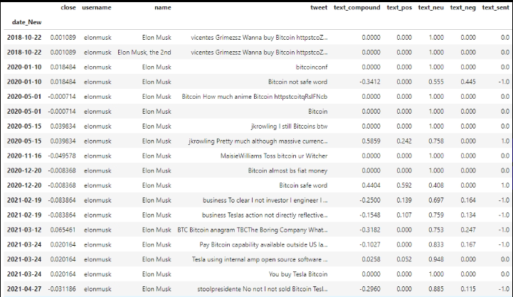
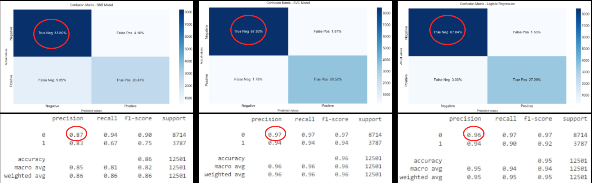
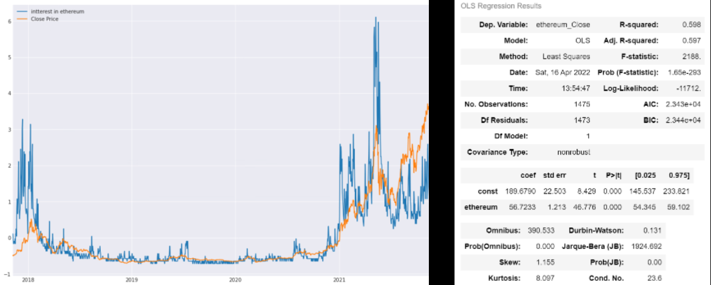

# Project-2 - Group B - Twitter Sentiment Analysis
  
## Sentiment Analysis Utilising Twitter, News and Crypto APIs
## Include the name of the project and group members.
Project twitters
Members include:
- Jacky Hong
- Charbel Nehme
- Kseniya Chadayeva
- Anthony Mura

## Project Presentation

2. [Project Presentation](https://github.com/JstJacks/Project-2/blob/main/TWITTER%20and%20WEB%20SENTIMENT%20ANALYSIS.pdf)

## Motivation & Summary Slide
We want to investigate if tweets posted from influencial people will have a positive/negative impact on the price of various asset classes such as cryptocurrency, commodities, stocks etc
## Define the core message, or hypothesis, of your project.
Conducting sentimental analysis of influencial twitter accounts, news articles and google trend. These sentiment scores will then be used as training data to predict future asset prices using various machine learning models.

## Model Summary
- Time Series Analysis
- Natural Language Processing
- Deep Learning

## Elaborate on the predictive model used, describing why it was the best choice for the data.
* Time Series Analysis
  Linear regression model was used to analyse the relationship between twitter sentiment score and the daily price change of crypto currency. 
* Natural Language Processing
  Vader sentiment analysis was used as we need to assign a score to each twitter post in order to determine if it is a positive or negative post and how these sentiment relates to price changes

  
## Tools Used
- Linear regression
- NLTK
- Vader sentiment analysis
- Sickit-Learn
- Tensorflow
- Keras
- Twitter API
- News API
- Alpaca API

# Twitter

### Describe the exploration and cleanup process.
1. pulled filtered data using twitter API (filtered by username and serach criteria such as "bitcoin")
2. conduct sentiment analysis to get sentiment score
3. obtain crypto currency data with yahoo finance
4. concat both data into a dataframe for time series analysis and predictions

### Discuss any problems that arose with preparing the data or training the model that you didn't anticipate.
- When doing twitter sentiment analysis on general population for a specific cryptocurrency, issues arose with the amount of data we can pull as there are more than 100,000 tweets about a certain topic such as bitcoin
- removed emojis from tweets which will affect the overall text sentiment
- sentiment analysis does not take into account photos and memes 
- even though some tweets are positive, it is not correctly reflected in sentiment scores due to model not being sophiscated enough

### Discuss the overall training process and highlight anything of interest with the training process: Cloud resources used, training time required, issues with training.
- some of the accounts are bots and do not reflect human sentiment\
- when conducting twitter general population analysis on a certain cryptocurrency, there were many neutral sentiments 

### Model Evaluation
Linear Regression Model
The result of the linear regression model on Elon Musk's tweets and the closing price of Bitcoin is quite interesting. We see a coefficient of determination of 0.00815, an intercept of 0.00858 and a slope of -0.121.
This demonstrates that there is little to no correlation in this small sample set for the price of Bitcoin and the sentiment score of Elon Musk. As the sentiment score of Elon Musk increases, the Bitcoin price still falls, according to this data. And this is one downfall of this small dataset.
The pitfalls of this result is that it isn't fully true as we identified with 2 plots that as Elon Musks tweets created a negative or positive sentiment, the price of Bitcoin drastically moved in the medium to long term, as seen in the plots. So the biggest pitfall of the linear regression is that it is basing its results on daily close prices and not weekly or monthly changes. To calculate this more time is needed.
Conclusion: Elon Musk tweets does affect the price of Bitcoin and other assets, however, predicting them with linear regression and LSTM is harder than you think.

### Discuss the techniques you used to evaluate the model performance.
The techniques used to evaluate the model performance was a accuracy score, confusion matrix and ROC CURVE. These techniques allowed us to evaluate the accuracy of the sentiment scores according to the tweets. It turns out this portion of the calculation worked very well. There is high accuracy in determining the correct sentiment score.
As we see from all 3 models:
Bernoulli Naive Bayes - precision 0.87
SVM (Support Vector Machine) - precision  0.97
Logistic Regression - precision 0.96

# Google trend
In many parts of the world nearly every aspect of day-to-day life now involves the internet. How the internet is navigated is through search engines and Google is far and away the world’s most popular search engine as it accounts for 74.52% of all internet searches. Google makes this data available through ”Google Trends”. Google Trends data provides information on how popular given search terms are relative to other search terms at any given time. In addition, these search term popularity values can be compared over time. This provides a proxy metric for the general interest there is in cryptocurrencies at any given time, which could have a relationship with cryptocurrency prices over time as general interest increases and decreases.

### Describe the exploration and cleanup process.
The data Google provides is not search volumes, but a search volume index (SVI). The search volume index is calculated by dividing each data point by the total searches within a geographic region and time range. The numbers are then scaled between 0 and 100 on a search term’s proportion to all searches on all topics.
When trends data is queried for a period of longer than 90 days the SVI returned are aggregated at a weekly level causing a problem so specific code was used. The daily data concatenated from multiple 1-month queries and normalized by corresponding weekly trends data. (the dailydata function implemented in pytrends). Query for multiple 9-month period was done with significant overlapping periods and used the overlapped period to have consistent scaling. The daily data then simply interpolated from the weekly data.
Source: Towards data science website “Reconstruct Google Trends Daily Data for Extended Period” by Qingzong Tseng

### Discuss any problems that arose with preparing the data or training the model that you didn't anticipate.
google trend datasets were only available for a rolling 90 days period, so in order to obtain all dataset for 5 years, we used data from another student's repo who has combined multiple years of google trend data

### Discuss the overall training process and highlight anything of interest with the training process
google trend searches and relative asset prices have a positive correlation, as the seraches for a certain term, e.g. "Bitcoin" increases on google, the asset price in most cases will increase in value which alings with out expectation as more and more people get into BTC, demand increases.

### Model Evaluation
To determine if a relationship is present between Google Trends search data and cryptocurrency price changes a correlation was ran for both currencies. The two primary metrics to determine this are the ”Pearson R” and the pvalue. The Pearson R is a measure of the strength of the correlation. Its value ranges from -1 to 1.
With these inputs a simple linear regression model, with the addition of lagged variables, accurately reflected future price changes. Future work could be done with lagged variables, more complex models, and not just linear ones like was used, could be fit using Google Trends and tweet volumes as inputs to see if results could be improved further.

### Discuss the techniques you used to evaluate the model performance.
There were 3 metrics used to evaluate simple linear egression model performance:
R Squared - is a statistical measure that represents the proportion of the variance for a dependent variable that's explained by an independent variable or variables in a regression model. 59.8% in the Ethereum case and 16.1% in Bitcoin.
MSE - is a measure of how close a fitted line is to data points. For every data point, the distance taken vertically from the point to the corresponding y value on the curve fit (the error),  and square the value.
MAE - is a measure of errors between paired observations expressing the same phenomenon.

# Dow Jones

### Describe the exploration and cleanup process. 

Alpaca Trade API was used to retrieve stock data for the model. Data exploration and cleaning via the API was complicated by Alpacas upgrade to Trader v2 API. In my opinion, the API documentation was prepared for users with an intermediate to an advanced level of computer science. As a beginner, I overcame this initial obstacle by referring to our previous training on APIs together with Alpacas Postman collection. Alpacas postman collection is available at the following URL - https://www.postman.com/alpacamarkets/workspace/alpaca-public-workspace/documentation/17430392-af6823e1-0e8c-4387-9cef-dffbfbae836f  

### Discuss any problems that arose with preparing the data or training the model that you didn't anticipate 

Overall model development was challenged by the limited time allocated to complete this project. In future projects, this problem may be overcome by assigning a dedicated role to each group member (in addition to the project manager) for data exploration, product management etc.  

### Discuss the techniques you used to evaluate the model performance. 

Tensorboard was used to evaluate model performance. Tensorboard is Tensorflow’s visual toolkit that provides various tools for machine learning experiments, some of which include the ability to view histograms of weights and biases as they change over time. Please see https://www.tensorflow.org/tensorboard for more details. 
